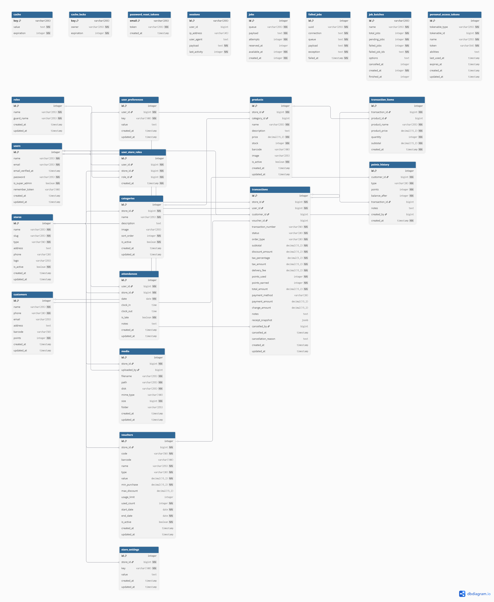

# Youni POS Application API

This is the backend API for the Youni POS Application, built with Laravel.

## 🚀 Getting Started

### Prerequisites

- PHP 8.2+
- Composer
- MySQL
- Node.js & NPM (for frontend if applicable)

### Installation

1.  Clone the repository
2.  Install dependencies:
    ```bash
    composer install
    ```
3.  Copy `.env.example` to `.env` and configure your database settings.
4.  Generate app key:
    ```bash
    php artisan key:generate
    ```
5.  Run migrations and seeders:
    Run [This Migration File](migration.sql) in the SQL Editor

    ```

    ```

6.  Serve the application:
    ```bash
    php artisan serve
    ```

---

## 🧪 Demo Accounts

The database seeder creates the following default accounts. All passwords are `password`.

| Role            | Email                | Password   |
| :-------------- | :------------------- | :--------- |
| **Super Admin** | `superadmin@pos.com` | `password` |
| **Store Admin** | `admin@pos.com`      | `password` |
| **Manager**     | `manager@pos.com`    | `password` |
| **Cashier**     | `cashier@pos.com`    | `password` |

**Demo Store Slug:** `kopi-kenangan`

---

## 📬 Postman Collection

A comprehensive Postman Collection is available to test all API endpoints.

[Postman Collection](postman_collection.json)

### How to use:

1.  Import the `postman_collection.json` file into Postman.
2.  Set up an environment with the following variables:
    - `base_url`: `http://localhost:8000/api` (or your server URL)
    - `token`: (Leave blank initially, update after login)
    - `storeSlug`: `kopi-kenangan` (or your store slug)
3.  Use the **Auth > Login** request to get a token.
4.  Copy the token to your environment's `token` variable.

---

## 📊 Database Schema (ERD)



or access it in https://dbdiagram.io/d/6993b00fbd82f5fce2e1f464
